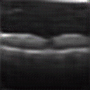

# Super-Resolution-GAN-for-Medical-Imaging
The purpose of this project is to both train and understand the uses of SRGANs for data manipulation and adding detail. The SRGAN in this repository was created adhering to the original SRGAN paper [ADD LINK] using the same models and training protocol. The data used was the Retinal OCT dataset from kaggle which is for a binary classification of DME or DRUSEN conditions. SRGAN were used to increase the resolution from 32x32 to 128x128.



# Installation 

Clone the repsistory into {ROOT}

`conda env create -f environment.yml`
This will install all required prerequisite for running the main body of the program
Next install pytorch, torchvision with your correct version of cuda or cpu


# Data preparation
The directory tree should look like this:
```
{ROOT}
|-- datasets
    |-- Retinal_OCT
    |   |   |-- test
    |   |   |   | -- DME
    |   |   |   | -- DRUSEN
    |   |   |-- train
    |   |   |   | -- DME
    |   |   |   | -- DRUSEN
|-- models
    |-- BC_A.pth
    |-- BC_B.pth
    |-- generator_model.pth
    |-- discriminator_model.pth
|-- progress
    |-- fk
    |-- hr
    |-- lr
```
