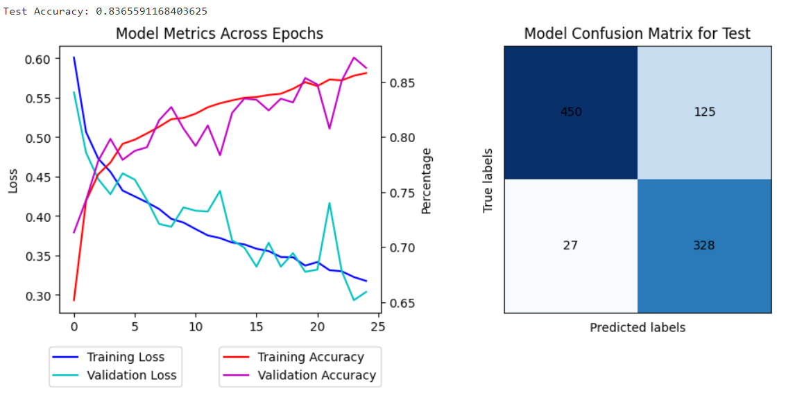

# Super-Resolution-GAN-for-Medical-Imaging
The purpose of this project is to both train and understand the uses of SRGANs for data manipulation and adding detail. The SRGAN in this repository was created adhering to the original SRGAN paper [ADD LINK] using the same models and training protocol. The data used was the Retinal OCT dataset from kaggle which is for a binary classification of DME or DRUSEN conditions. SRGAN were used to increase the resolution from 32x32 to 128x128.


# Installation 

Clone the repsistory into {ROOT}

`conda env create -f environment.yml`
This will install all required prerequisite for running the main body of the program
Next install pytorch, torchvision with your correct version of cuda or cpu


# Data preparation
The directory tree should look like this:
```
{ROOT}
|-- datasets
    |-- Retinal_OCT
    |   |   |-- test
    |   |   |   | -- DME
    |   |   |   | -- DRUSEN
    |   |   |-- train
    |   |   |   | -- DME
    |   |   |   | -- DRUSEN
|-- models
    |-- BC_A.pth
    |-- BC_B.pth
    |-- generator_model.pth
    |-- discriminator_model.pth
|-- progress
    |-- fk
    |-- hr
    |-- lr
```

# Results
This section will show the results of training on the different models of the model

## Model Trained on full Res infomation 128x128 Model A


## Model Trained on low Res infomation 32x32 Model A_32


## Model Trained on generated infomation 128x128 Model B


Accuracy Metrics are as follows
```
F1 Score:
  A: 1.0000
  B: 0.9333
  A32: 0.7429

Accuracy:
  A: 1.0000
  B: 0.9412
  A32: 0.8824

AUC:
  A: 1.0000
  B: 0.9826
  A32: 0.9615
  ```

As we can see from the following trainings the model trained on the original infomation at the highest resolution of 128 preformed the best at 99.0% accuracy. The same model on original data scaled down to 32 preformed the worst of all the models at 83.8% (Model A_32) accuracy showing the additional infomation from the generator provides a better ability to generalize on training infomation. The model which worked with generated infomation preformed at almost 10% higher than the A_32 Model at an accuracy of 94.8%.

# Location of Each Assigment Requirement

### Train a binary classifier (called A) 
Located in TrainClassifier.ipynb (All classification models were trained here)

### Train the SRGAN to generate 128x128 images
Located in TrainSRGAN.ipynb

### Examples of scaled images in JNB 
Gif on main page as well as examples on TrainSRGAN.ipynb during training

### SRGAN in order to train a new model (called B)
Located in TrainClassifier.ipynb (All classification models were trained here)

### Train the SRGAN for at least 150 epochs
SRGRAN was trained for 285 EPOCHS as shown in TrainSRGAN.ipynb

### Divide the dataset into 70% training and 30% testing
The dataset is already split by testing and training, I didnt see a purpose in doing this

### Apply normalization and image transformation show some of the transformed samples
NORALIZATION LOCATED IN utils/trainer.py this was created in the customdataset not in the training file. Normalization is commented out in the TrainClassifier.ipynb due to the formating of the customdataset. However it is present. Images are demonstrated in TrainClassifier.ipynb as last trained network was Model B.

### Compare the performance of both models
Images in readme

### Save your models after each n epoch
Located in utils/Training_Functions.py
Models located in utils/Models.py
